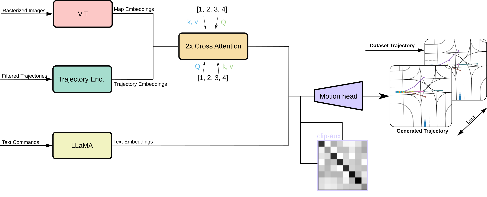

# Llama_traffic

## Llama_Traffic
The generation of realistic high quality trajectories is a major bottleneck in the creation of autonomous driving agents.



Llama_Traffic tackles this problem by facilitating the language-based creation of original trajectories.

### Table of Contents

1. [Introduction](#introduction)
2. [Installation](#installation)
3. [Usage](#usage)
4. [Features](#features)
5. [Contribution](#contribution)
6. [Tests](#tests)
7. [License](#license)
8. [Acknowledgements](#acknowledgements)
9. [Contact](#contact)

### Introduction

Detailed introduction of the project including the problem it aims to solve and its relevance.

### Installation

```bash

# Go into project folder ("llama_traffic")
cd llama_traffic

# Create conda environment
conda env create -f environment.yml
```

## Usage

### Starting the Command Line Interface

```bash
# Start the CLI
python waymo_cli.py

# Show all available commands
help
```

