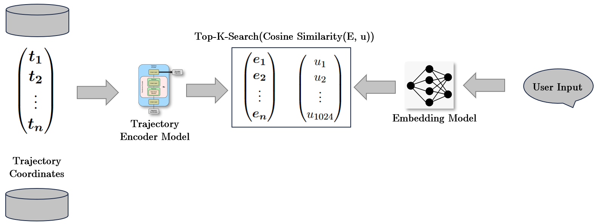

# Llama_traffic

  

## Llama_Traffic

The generation of realistic high quality trajectories is a major bottleneck in the creation of autonomous driving agents.

  



  

Llama_Traffic tackles this problem by facilitating the language-based creation of original trajectories.

## Table of Contents

1. [Introduction](#introduction)
2. [Installation](#installation)
3. [Usage](#usage)
4. [Features](#features)
	1. [Functions](#Functions)
	2. [Models](#Models)
6. [License](#license)
7. [Acknowledgements](#acknowledgements)
8. [Contact](#contact)

  

## Introduction

This project constitutes a CLI to handle the [Waymo Open Dataset]([Open Dataset – Waymo](https://waymo.com/open/)). Its main purpose is to explore different models for trajectory two dimensional prediction. For an overview of the different models implemented see the section 

## Installation

==Please make sure that you have [conda installed]([Installation — conda 23.10.1.dev61 documentation](https://conda.io/projects/conda/en/latest/user-guide/install/index.html)).==

```bash
# Clone the repository e.g.:
git clone https://github.com/PaulKMueller/llama_traffic.git

# Go into project folder ("llama_traffic")
cd llama_traffic

# Create conda environment and install the necessary dependencies
conda env create -f environment.yml

```

## Usage

### Starting the Command Line Interface
The entry point to the CLI is the cly.py.
You can start it the following way:
  
```bash
# Start the CLI
python cli.py

# Show all available commands
help
```

## Features

### Functions
get_zipped_data                      
classification                  
clear_buckets
help                                 
clear_output_folder
infer_with_neural_network            
create_neural_network
init_bucket_embeddings               
create_transformer_model
list_scenarios                       
exit
load_scenario                        
filter_trajectories
plot_all_trajectories                
get_bert_embedding
plot_map                             
get_bucket_embedding
plot_predicted_trajectory            
get_cohere_similarities
plot_raw_coordinates_without_scenario
get_coordinates
plot_scenario                        
get_delta_angles_for_vehicle
plot_spline                          
get_direction
plot_trajectory                      
get_displacement
plot_vehicle                         
get_positional_encoding
print_current_raw_scenario           
get_scenario_index
store_raw_scenario                   
get_scenario_labeled_trajectories
test_trajectory_bucketing            
get_similarity
total_delta_angle_for_vehicle        
get_spline
train_neural_network                 
get_total_angle_for_vehicle
train_transformer_network            
get_trajectories_for_text_input
training_data_length                 
get_vehicles_in_loaded_scenario
visualize_trajectory   

### Models

## License

> Copyright 2023 Paul Müller
> 
> Permission is hereby granted, free of charge, to any person obtaining a copy of this software and associated documentation files (the “Software”), to deal in the Software without restriction, including without limitation the rights to use, copy, modify, merge, publish, distribute, sublicense, and/or sell copies of the Software, and to permit persons to whom the Software is furnished to do so, subject to the following conditions:
> 
> The above copyright notice and this permission notice shall be included in all copies or substantial portions of the Software.
> 
> THE SOFTWARE IS PROVIDED “AS IS”, WITHOUT WARRANTY OF ANY KIND, EXPRESS OR IMPLIED, INCLUDING BUT NOT LIMITED TO THE WARRANTIES OF MERCHANTABILITY, FITNESS FOR A PARTICULAR PURPOSE AND NONINFRINGEMENT. IN NO EVENT SHALL THE AUTHORS OR COPYRIGHT HOLDERS BE LIABLE FOR ANY CLAIM, DAMAGES OR OTHER LIABILITY, WHETHER IN AN ACTION OF CONTRACT, TORT OR OTHERWISE, ARISING FROM, OUT OF OR IN CONNECTION WITH THE SOFTWARE OR THE USE OR OTHER DEALINGS IN THE SOFTWARE.